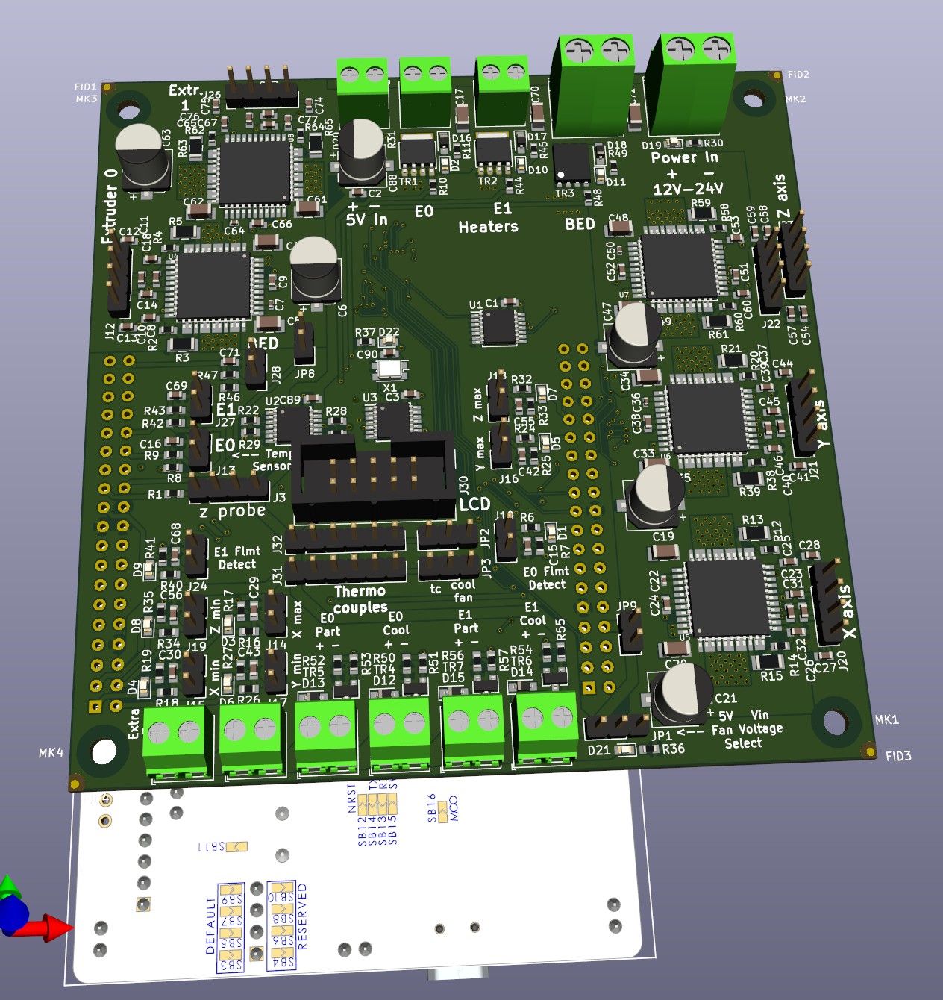

Prntr Board V1
======================
PrntrBoard is a 3D printer controller board designed to work with STM32 NUCLEO dev kits. The current version (V1) supports NUCLEO-64 series kits. The design is being developed on F446-RE kit, but other models could work as well. IMO the STM32F446 NUCLEO-64 kit offers very good performance (180MHz CPU) for the price ($15).

Some features of the board:
-----
  + 5x Trinamic super quiet drivers (TMC2130 or TMC2660)
  + Marlin firmware
  + (2+2) controllable fans and 2x "always on" fan connectors
  + 3 min and 3 max limit switches for the xyz axis.
  + 2 limit switches for fillament detection.
  + SPI lcd connector for ST7735 screen
  + Dual thermocouple connectors (for MAX31866, MAX31855 or MAX6675 boards)
  + selectable fan voltage (5V or Vin)

Because the NUCLEO-64 has limited number of IO pins, some compromises had to be made:
  + No sd-card
  + The thermocouple connectors share pins with the E0 and E1 cool fan controls. You'll have to decide to use one or the other via jumpers on the board. Most printers I've seen come with "always on" extruder fans, the choice seemed like a worthy sacrifice.

Generic shortcuts I don't plan to improve:
------
  + 5V power supply is external. These are available from various resellers and fairly cheap - less than $1. No need to waste board layout space and component count.
  + Heated bed MOSFET - large heated beds consume a lot of power and it is challenging to provision the design for > 10A current. External heated bed MOSFETs are very affordable < $10 and claim to support 20A minimum. If you have large bet use one.

Details
------
I use the daily build of KiCad (soon to be released V5) - let me know if you have trouble opening the files. The schematics uses hierarchical components, which was not supported in earlied versions of KiCad.

The current PCB desing is using 4 layer board, 6/6 mil track width/clearance, 12 mil via hole size and 20 mil via diameter.

There are two active branches:
  + tmc2130 - the board design for TMC2130 drivers
  + tmc2660 - the board design for TMC2660 drivers

Both PCB designs use the QFP version of the driver ICs, because they can handle a bit more power.

Status
------
I have re-designed the tmc2660 pcb. Incorporated changes I made from the tmc2130 branch. I ordered a batch of PCBs for validation. Still not happy with the layout of the E1 driver. I may reposition the E1 driver relative to the 5V input connector. I'm considering switching to JST connectors for the stepper motor drivers.

Software
------

The software for the board is a clone of Marlin at [bugfix-2.0.x branch](https://github.com/ghent360/Marlin/tree/bugfix-2.0.x/ "Github.com") of my repository. I keep it relatively in sync with the Marlin branch. *Note: there are other branches of Marlin as well only the bugfix-2.0.x supports the STM32 microcontroller.*

Marlin is using Adruino IDE or Platform IO. I personally had issues with Platform IO not supporting the STM32F4 board, so I use Arduino version 1.8.5. To compile the firmware code you would need to install the [STM32 Arduino port](https://github.com/stm32duino/Arduino_Core_STM32 "www.stm32duino.com").

Visit [my blog](http://blog.pcbxprt.com/) for status updates on the development of the board.
